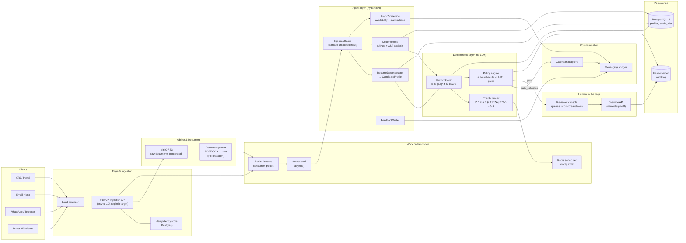
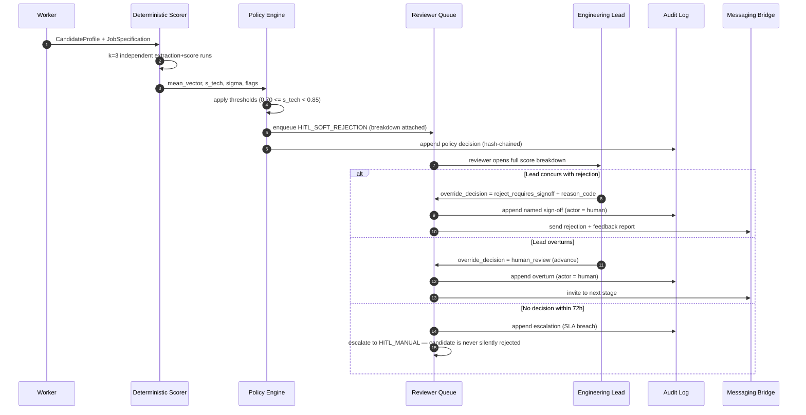
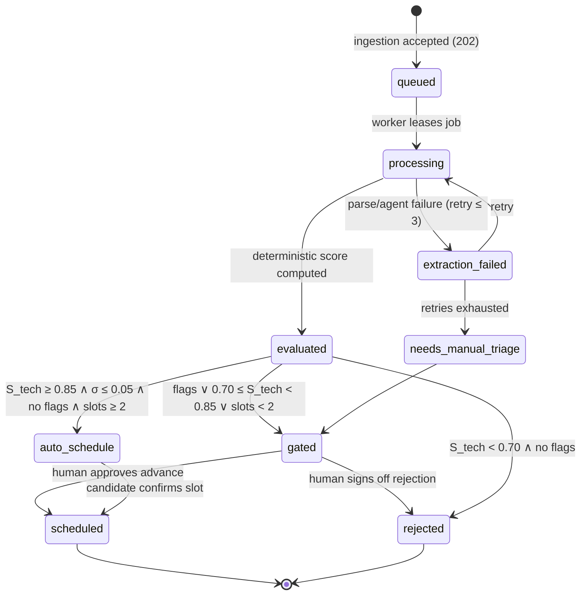
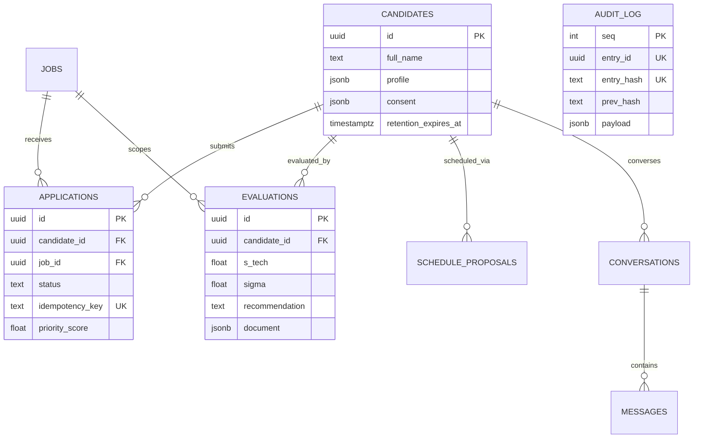

# System Architecture

**Version:** 0.1.0 · **Status:** contracts frozen, implementation in progress

## 1. Overview

HRAgents is a four-stage pipeline with one rule: **agents extract, code decides, humans gate.**

```
Extract (LLM, nondeterministic)  →  Score (pure Python, deterministic)  →  Gate (policy + HITL)  →  Communicate (bridges + feedback)
```

The system is designed against the evidence base in `docs/research/literature-review.md`:
screening decisions must be fast, consistent, inspectable, non-discriminatory, and contestable.

## 2. End-to-end flow



## 3. HITL soft-rejection flow

The most consequential path in the system: a candidate scores above the technical-merit floor
but below the advance bar. No rejection may be sent without a named human sign-off.



## 4. Application lifecycle



## 5. Components

| Component | Responsibility | Deterministic? | Notes |
|---|---|---|---|
| Ingestion API | Accept applications, validate, persist, enqueue | Yes | Returns `202`; idempotency-keyed |
| Document parser | PDF/DOCX → text; hash; PII redaction | Yes | Redaction precedes any LLM call |
| InjectionGuard | Neutralize prompt injection in untrusted text | Yes (rules) | LLM-visible content is sanitized |
| ResumeDeconstructor | Résumé text → `CandidateProfile` | No (LLM) | Output validated by Pydantic v2; every field carries provenance |
| CodePortfolioAgent | GitHub + AST metrics (complexity, tests, deps) | Mixed | Numeric metrics deterministic; summaries LLM-assisted |
| Deterministic Scorer | Evidence → `ScoreVector`, k=3, aggregation | **Yes** | Pure Python; no model calls |
| Priority ranker | `P = α·S̄ + β·e^(−λ·Δt) + γ·A − δ·R` | **Yes** | Redis sorted set; p99 < 50 ms |
| Policy engine | Automation gates per §7 | **Yes** | Thresholds snapshotted into every decision |
| AsyncScreeningAgent | Availability, clarifications, consent | No (LLM) | Sandbox mode by default; human handoff available |
| FeedbackWriter | Candidate-facing report | No (LLM) | Constrained to deterministic breakdown; no internal notes |
| Audit writer | Append-only hash chain | **Yes** | `entry_hash` covers payload + `prev_hash` |
| Reviewer console | Queues, breakdowns, override actions | N/A | Human interface; RBAC-enforced |

## 6. Data model (core entities)



## 7. Latency and throughput budget

| Path | Target | Mechanism |
|---|---|---|
| Ingestion accept (`POST /v1/applications`) | p99 < 150 ms | Async write + enqueue only; no synchronous processing |
| Sustained ingestion | 10,000 req/min | Horizontal API replicas; Redis Streams backpressure |
| Priority queue read (`GET /v1/queue`) | p99 < 50 ms | Precomputed sorted set; cursor pagination |
| Deterministic scoring | < 100 ms per candidate | Pure Python over JSON; k=3 runs |
| Full extraction pipeline | < 10 min p95 | Async workers; bounded retries with dead-letter |
| First candidate-facing response | < 24 h | SLA timer per conversation |

## 8. Failure modes and mitigations

| Failure | Mitigation |
|---|---|
| LLM output invalid/malformed | Pydantic v2 validation + bounded retries; profile marked `low_confidence_extraction` |
| LLM unavailable | Degraded mode: deterministic scoring over parsed structured fields; queue holds work |
| Extraction variance too high (σ > 0.05) | Auto-scheduling blocked; routed to human review |
| Prompt injection in résumé | InjectionGuard + output validation; injection flags force HITL |
| Duplicate submissions | Idempotency keys; document hashing; profile de-duplication |
| Calendar starvation (< 2 slots) | HITL_CALENDAR routing; candidate communication continues |
| Audit tampering | Hash chain verification job; any mismatch raises a blocking incident |
| Consent revoked mid-pipeline | `has_active_consent` checkpoint; processing halts; retention job purges per policy |

## 9. Security and compliance touchpoints

- **PII redaction before model calls** — names, photos, addresses, birth dates, and protected
  attributes never reach scoring, and are minimized in model prompts.
- **No protected attributes in scoring** — enforced by schema (scoring consumes only the four
  job-relevant dimensions) and verified by the fairness harness (counterfactual name-swap audits).
- **RBAC** — override endpoints restricted to `engineering_lead`, `recruiter_lead`, `hr_partner`.
- **Audit chain** — every policy decision, score, override, and outbound notification is appended
  with `prev_hash`/`entry_hash`.
- **Retention** — per-entity operator policies (months + delete/anonymize) over the retention ledger;
  scheduled purge skips legal holds and reports uncovered entities. No statutory window is hardcoded.
- **Data-subject rights** — consent registry, retention scan/purge, erasure workflow (human identity
  verification → Data Protection approval → separate human execution), and explanation via feedback
  reports map to UU PDP obligations. Implementation: `hr_agents.services.compliance`.

## 10. Cross-references

- Automation boundaries and thresholds: `docs/architecture/hitl-bounds.md`
- Evidence and design rationale: `docs/research/literature-review.md`
- API contract: `docs/api/openapi.yaml`
